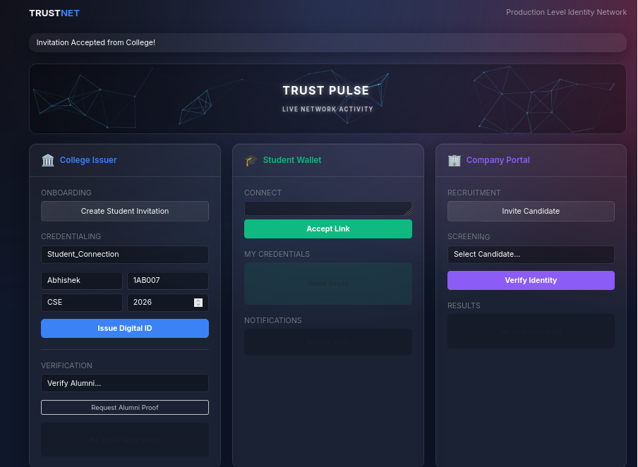
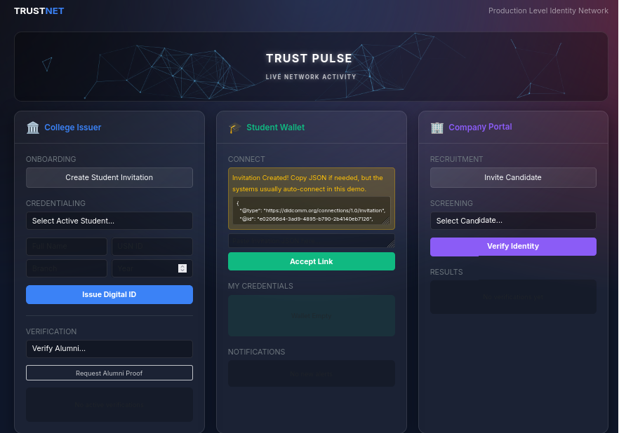
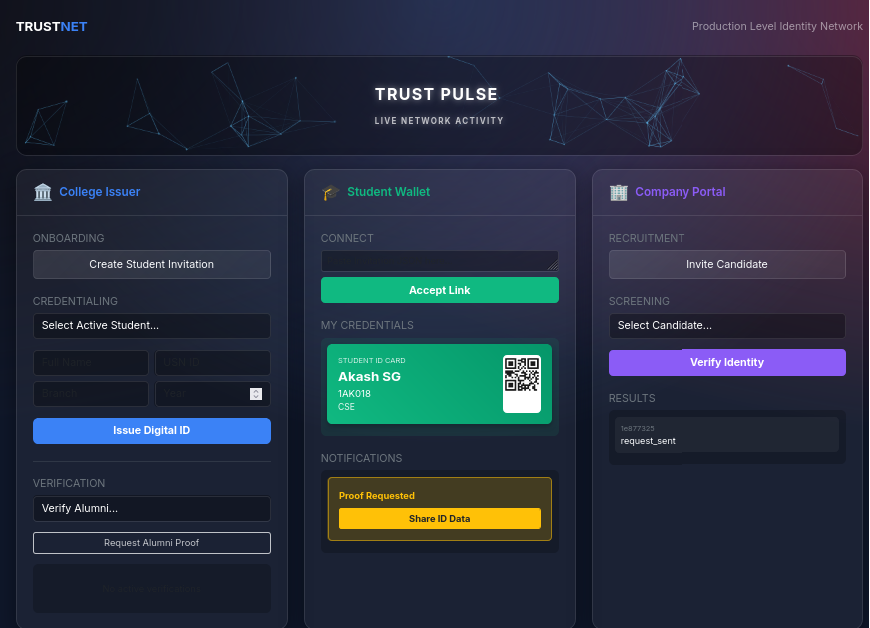
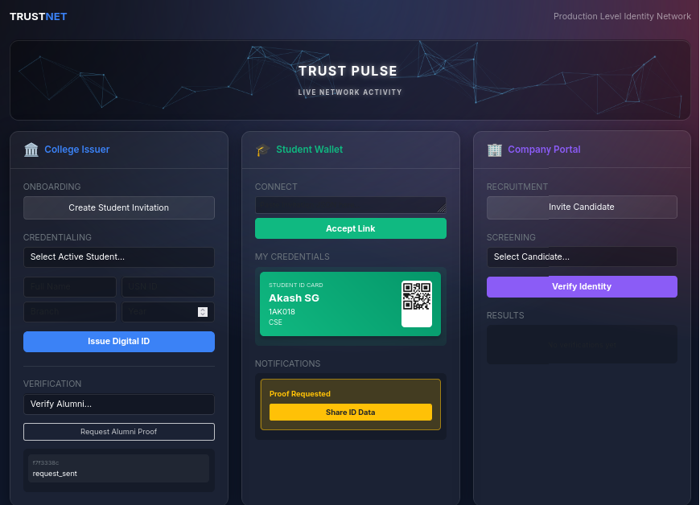
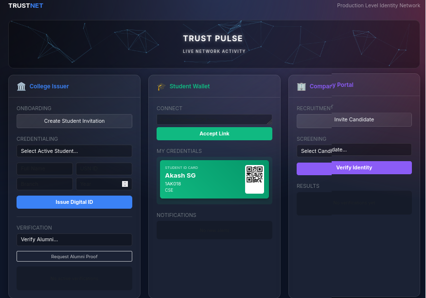

<p align="center">
  <strong>🔐 TRUST</strong>NET — Blockchain-Based Student Identity Verification System
</p>

<p align="center">
  
  
  
  
  
</p>

---

## 📖 Overview

**TrustNet** is a production-grade **Self-Sovereign Identity (SSI)** system built on top of **Hyperledger Indy** and **Aries Cloud Agent Python (ACA-Py)**. It demonstrates a real-world use case where:

- 🏛️ A **College** issues verifiable digital student ID cards  
- 🎓 A **Student** stores credentials in a digital wallet  
- 🏢 A **Company** verifies student identity during recruitment  

All identity interactions happen on a **decentralized blockchain ledger** — no central authority controls the data. The student owns their identity.

> Built on top of the [bcgov/von-network](https://github.com/bcgov/von-network) — a portable Hyperledger Indy node network.

---

## 🖼️ Screenshots

### 1. Dashboard — Connection Accepted
The main TrustNet dashboard showing three agent panels. The student has just accepted an invitation from the College.



### 2. Invitation Created
The College creates a DIDComm invitation JSON that the Student can accept to establish a peer-to-peer connection.



### 3. Credential Issued & Proof Requested
The Student's wallet now contains a verifiable Student ID Card (with QR code). A proof request from the Company is pending.



### 4. College Requesting Alumni Proof
The College can also verify alumni status by requesting a proof from the Student's wallet.



### 5. Credential Stored in Wallet
The Student's credential is securely stored in their digital wallet, ready to be presented to any verifier.



---

## 🏗️ Architecture

```
┌─────────────────────────────────────────────────────────────────┐
│                        NGINX (HTTPS :443)                       │
│                     Reverse Proxy + SSL/TLS                     │
└──────────────────────────┬──────────────────────────────────────┘
                           │
                           ▼
┌─────────────────────────────────────────────────────────────────┐
│                    Flask Web UI (:5000)                          │
│              TrustNet Dashboard (app.py)                         │
│         College Issuer │ Student Wallet │ Company Portal         │
└────────┬───────────────┼───────────────┼────────────────────────┘
         │               │               │
         ▼               ▼               ▼
┌──────────────┐ ┌──────────────┐ ┌──────────────┐
│ College Agent│ │ Student Agent│ │ Company Agent│
│  ACA-Py      │ │  ACA-Py      │ │  ACA-Py      │
│  :8024/:8033 │ │  :8022/:8031 │ │  :8026/:8035 │
└──────┬───────┘ └──────┬───────┘ └──────┬───────┘
       │                │                │
       └────────────────┼────────────────┘
                        ▼
┌─────────────────────────────────────────────────────────────────┐
│              Hyperledger Indy Ledger (4 Nodes)                  │
│         Node1(:9701-02) Node2(:9703-04)                         │
│         Node3(:9705-06) Node4(:9707-08)                         │
│                                                                 │
│              + Webserver (Ledger Browser :8000)                  │
└─────────────────────────────────────────────────────────────────┘
```

### Key Components

| Component | Technology | Purpose |
|-----------|-----------|---------|
| **Ledger** | Hyperledger Indy (4 validator nodes) | Decentralized blockchain for DID/Schema/CredDef storage |
| **Agents** | Aries Cloud Agent Python (ACA-Py) v0.12 | DIDComm messaging, credential issuance, proof verification |
| **Web UI** | Flask + Bootstrap 5 | Unified dashboard for all three actors |
| **Reverse Proxy** | Nginx with self-signed SSL | HTTPS termination, routing |
| **Orchestration** | Docker Compose | Single-command deployment of all services |

---

## 🚀 Prerequisites

- **Docker** (v20.10+) and **Docker Compose** (v2+)
- **Python 3.8+** (for running `setup_ledger.py` locally)
- **Git**
- At least **4 GB RAM** available for Docker

---

## ⚡ Quick Start

### Step 1: Clone the Repository

```bash
git clone https://github.com/<your-username>/von-network.git
cd von-network
```

### Step 2: Build the Base VON Network Image

```bash
./manage build
```

> ⏳ This builds the Hyperledger Indy node base image. It takes a few minutes on the first run.

### Step 3: Generate Self-Signed SSL Certificates

```bash
mkdir -p config/nginx/certs
cd config/nginx/certs

# Generate DH parameters
openssl dhparam -out dhparam.pem 2048

# Generate self-signed certificate
openssl req -x509 -nodes -days 365 \
  -newkey rsa:2048 \
  -keyout nginx-selfsigned.key \
  -out nginx-selfsigned.crt \
  -subj "/CN=localhost"

cd ../../..
```

### Step 4: Start the Full Stack

```bash
docker compose -p von -f full-stack-compose.yml up -d
```

This starts **10 containers**:
- 4 Indy validator nodes
- 1 Indy client
- 1 Ledger webserver
- 3 ACA-Py agents (Student, College, Company)
- 1 Web UI (Flask)
- 1 Nginx reverse proxy

### Step 5: Wait for Services to Initialize

```bash
# Wait ~40 seconds for all nodes to sync and agents to provision wallets
sleep 40
```

### Step 6: Register DIDs on the Ledger

```bash
# Register the three agent DIDs as Trust Anchors
docker exec von-webserver-1 curl -s -X POST http://localhost:8000/register \
  -d '{"seed":"Student0000000000000000000000001","role":"TRUST_ANCHOR","alias":"Student"}' \
  -H "Content-Type: application/json"

docker exec von-webserver-1 curl -s -X POST http://localhost:8000/register \
  -d '{"seed":"College0000000000000000000000001","role":"TRUST_ANCHOR","alias":"College"}' \
  -H "Content-Type: application/json"

docker exec von-webserver-1 curl -s -X POST http://localhost:8000/register \
  -d '{"seed":"Company0000000000000000000000001","role":"TRUST_ANCHOR","alias":"Company"}' \
  -H "Content-Type: application/json"
```

### Step 7: Create Schema & Credential Definition

```bash
# Wait for agents to pick up their DIDs
sleep 10

# Run the setup script
pip install requests  # if not already installed
python3 aries_ui/setup_ledger.py
```

You'll see output like:
```
🚀 Registering Schema and Cred Def on Ledger...
🔹 Creating Schema: skit_student_id_XXXX...
✅ Schema ID: GHiehWQfcT89c7di62WriQ:2:skit_student_id_XXXX:1.0
🔹 Creating Credential Definition...
✅ Cred Def ID: GHiehWQfcT89c7di62WriQ:3:CL:XX:default

--- ⚠️ COPY THESE NEW IDs INTO app.py ⚠️ ---
```

### Step 8: Update IDs in `app.py`

Open `aries_ui/app.py` and update the `SCHEMA_ID` and `CRED_DEF_ID` values with the output from the previous step:

```python
SCHEMA_ID = "GHiehWQfcT89c7di62WriQ:2:skit_student_id_XXXX:1.0"  # Your schema ID
CRED_DEF_ID = "GHiehWQfcT89c7di62WriQ:3:CL:XX:default"           # Your cred def ID
```

### Step 9: Rebuild the Web UI Container

```bash
docker compose -p von -f full-stack-compose.yml up -d --build --force-recreate web-ui
```

### Step 10: Open the Dashboard

Navigate to **https://localhost** in your browser.

> ⚠️ You'll see a browser warning about the self-signed certificate. Click **"Advanced"** → **"Proceed to localhost"** to continue.

---

## 🎯 Demo Flow

### 1️⃣ Establish Connection (College ↔ Student)

1. On the **College Issuer** panel, click **"Create Student Invitation"**
2. The invitation JSON will appear in the **Student Wallet** panel
3. The system auto-accepts the invitation
4. Refresh the page — you'll see **"Invitation Accepted from College!"**

### 2️⃣ Issue Digital Student ID

1. On the **College Issuer** panel, select the active student connection
2. Fill in the student details:
   - **Name**: e.g., "Akash SG"
   - **USN**: e.g., "1AK018"
   - **Branch**: e.g., "CSE"
   - **Year**: e.g., "2026"
3. Click **"Issue Digital ID"**
4. Refresh the page — the student should see the credential offer
5. Click **"Accept"** → then **"Store"** on the Student panel
6. The **Student ID Card** with a QR code will appear in the wallet!

### 3️⃣ Connect with Company

1. On the **Company Portal**, click **"Invite Candidate"**
2. The invitation auto-connects with the student
3. Refresh to confirm active connection

### 4️⃣ Verify Student Identity

1. On the **Company Portal**, select the student and click **"Verify Identity"**
2. On the **Student Wallet**, you'll see a **"Proof Requested"** notification
3. Click **"Share ID Data"** to present the verifiable proof
4. Back on the Company panel, click **"Verify"** to cryptographically validate

✅ The result will show **"Verified: True ✅"** — the student's identity is confirmed without any central database!

---

## 📁 Project Structure

```
von-network/
├── aries_ui/                          # 🎨 TrustNet Web Application
│   ├── app.py                         # Flask backend (routes, agent communication)
│   ├── Dockerfile                     # Docker image for the web UI
│   ├── setup_ledger.py                # Schema & credential definition registration
│   ├── clear_wallet.py                # Utility to reset agent wallets
│   ├── docker-compose.yml             # Standalone compose (for development)
│   └── templates/
│       └── dashboard.html             # Main UI template (Bootstrap 5)
│
├── config/
│   └── nginx/
│       ├── nginx.conf                 # Nginx reverse proxy configuration
│       └── certs/                     # Self-signed SSL certificates
│
├── full-stack-compose.yml             # 🐳 Production Docker Compose (all services)
├── screenshots/                       # 📸 Project screenshots
│
├── ssi-app/                           # Legacy SSI app (separate Flask apps)
│   ├── issuer_app/                    # College issuer (standalone version)
│   ├── student_wallet/                # Student wallet (standalone version)
│   └── verifier_app/                  # Company verifier (standalone version)
│
├── server/                            # VON Network ledger browser server
├── scripts/                           # Node startup scripts
├── config/                            # Ledger configuration
├── docs/                              # VON Network documentation
├── manage                             # VON Network management script
├── docker-compose.yml                 # Original VON Network compose
├── Dockerfile                         # VON Network base image
└── README.md                          # This file
```

---

## 🛑 Stopping and Restarting

### Stop everything:
```bash
docker compose -p von -f full-stack-compose.yml down
```

### Restart (fresh):
```bash
# Remove old volumes to start clean
docker compose -p von -f full-stack-compose.yml down -v

# Start again
docker compose -p von -f full-stack-compose.yml up -d

# Wait, register DIDs, run setup_ledger.py again (Steps 5-9)
```

### View logs:
```bash
# All services
docker compose -p von -f full-stack-compose.yml logs -f

# Specific service
docker logs von-web-ui-1 -f
docker logs von-college-agent-1 -f
```

---

## 🔧 Configuration

### Agent URLs (in `aries_ui/app.py`)

| Variable | Default | Description |
|----------|---------|-------------|
| `STUDENT_AGENT` | `http://localhost:8022` | Student ACA-Py admin API |
| `COLLEGE_AGENT` | `http://localhost:8024` | College ACA-Py admin API |
| `COMPANY_AGENT` | `http://localhost:8026` | Company ACA-Py admin API |

> When running inside Docker, these are overridden via environment variables in `full-stack-compose.yml` to use Docker service names (e.g., `http://student-agent:8022`).

### Ports

| Port | Service |
|------|---------|
| 80 | HTTP → HTTPS redirect |
| 443 | **TrustNet Dashboard (HTTPS)** |
| 8022 | Student Agent Admin API |
| 8024 | College Agent Admin API |
| 8026 | Company Agent Admin API |
| 8031 | Student Agent Inbound |
| 8033 | College Agent Inbound |
| 8035 | Company Agent Inbound |
| 9701-9708 | Indy Validator Nodes |

---

## 🧠 How It Works (SSI Concepts)

### Decentralized Identifiers (DIDs)
Each agent (Student, College, Company) has a unique DID registered on the Indy ledger. DIDs are like blockchain addresses for identity.

### Verifiable Credentials
The College writes a **Schema** (defining fields: name, USN, branch, year) and a **Credential Definition** to the ledger. Using these, it can issue tamper-proof digital credentials to students.

### Zero-Knowledge Proofs
When a Company asks to verify a student's identity, the student can share a **cryptographic proof** without revealing unnecessary information. The proof is verified against the ledger — no need to call the College!

### Trust Triangle

```
         College (Issuer)
        /                \
       / Issues            \ Schema & CredDef
      /   Credential        \ on Ledger
     ▼                       ▼
  Student ──────────────► Company
  (Holder)   Presents     (Verifier)
             Proof
```

---

## 🛠️ Tech Stack

| Technology | Version | Role |
|-----------|---------|------|
| [Hyperledger Indy](https://www.hyperledger.org/projects/hyperledger-indy) | - | Distributed ledger for decentralized identity |
| [Aries Cloud Agent Python](https://github.com/hyperledger/aries-cloudagent-python) | 0.12 LTS | DIDComm agent framework |
| [VON Network](https://github.com/bcgov/von-network) | Latest | Portable Indy node network |
| [Flask](https://flask.palletsprojects.com/) | 3.x | Web application framework |
| [Bootstrap](https://getbootstrap.com/) | 5.3 | Frontend CSS framework |
| [Nginx](https://nginx.org/) | Alpine | Reverse proxy with SSL |
| [Docker](https://www.docker.com/) | 20.10+ | Containerization |

---

## 📝 Notes

- This project is for **educational and demonstration purposes only** — not for production use
- The Indy ledger nodes run locally; this is **not** connected to any public blockchain network
- SSL certificates are self-signed; browsers will show a security warning
- Agent wallets are stored in Docker volumes; use `docker compose down -v` to reset everything
- The `ssi-app/` directory contains an earlier version of the project with separate Flask apps for each actor

---

## 🙏 Credits

- **VON Network** by [BC Gov](https://github.com/bcgov/von-network) — The foundation for the Indy ledger
- **Aries Cloud Agent Python** by [Hyperledger](https://github.com/hyperledger/aries-cloudagent-python) — The agent framework
- Built as a demonstration project for **Self-Sovereign Identity** concepts

---

## 📄 License

This project is licensed under the [Apache License 2.0](LICENSE).
